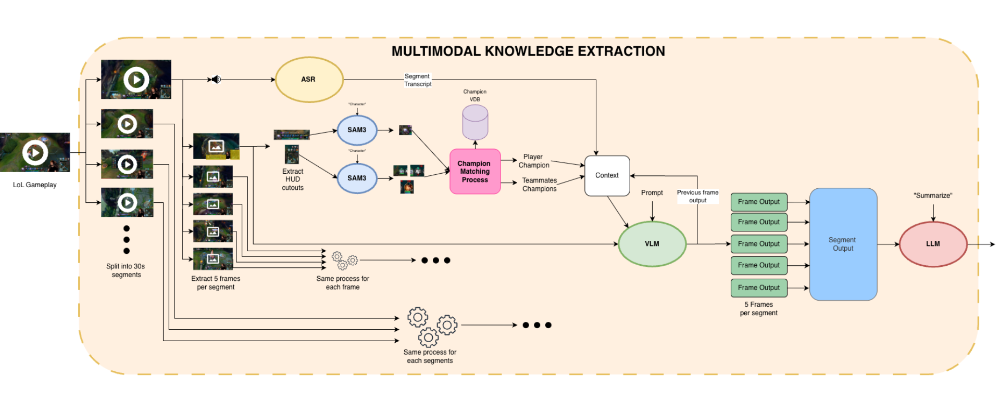
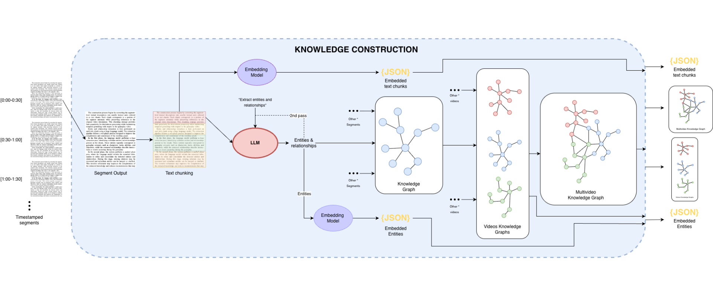
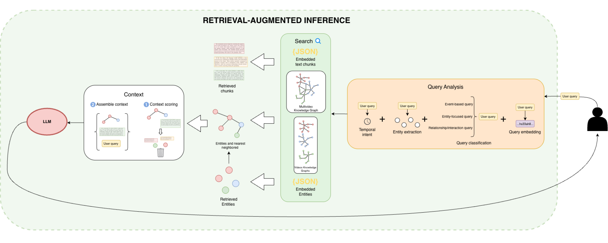

# Multimodal LoL-RAG

Multimodal LoL-RAG is a League of Legends video understanding and question-answering system. It turns raw gameplay videos into sanitized multimodal knowledge artifacts, builds vector indexes and knowledge graphs from them, and serves grounded answers through a small API and frontend.

This README covers only the current system in scope:

- `knowledge_extraction/`
- `knowledge_sanitization/`
- `knowledge_build/`
- `knowledge_inference/`
- `knowledge_pipeline/`
- `knowledge_api_server/`
- `knowledge_frontend/`

It intentionally does not document `playground/` or other experimental folders.


## High-Level Pipeline

The system runs in four core phases plus two serving layers:

1. `knowledge_extraction/` converts a gameplay video into structured multimodal artifacts.
2. `knowledge_sanitization/` cleans and normalizes those artifacts before and after graph construction.
3. `knowledge_build/` creates chunk stores, vector indexes, and chunk-entity graphs.
4. `knowledge_inference/` answers user questions from sanitized build outputs only.
5. `knowledge_api_server/` exposes the inference service over HTTP.
6. `knowledge_frontend/` provides the chat UI for end users.

### 1. Extraction

`knowledge_extraction/` is the ingestion stage. For each queued video, it:

- splits the source video into temporal segments,
- samples frames from each segment,
- identifies the main champion and partners from HUD regions,
- transcribes audio,
- generates frame-level visual descriptions,
- summarizes each segment into structured JSON artifacts.

The main entrypoint is `knowledge_extraction/extractor.py`, and the heavy model work is delegated to:

- `knowledge_extraction/entity_server.py`
- `knowledge_extraction/vlm_asr_server.py`
- `knowledge_extraction/segment_summarization_server.py`

Outputs are written under:

- `knowledge_extraction/cache/extracted_data/<video_name>/`



### 2. Sanitization

`knowledge_sanitization/` is a two-step contract layer:

- `pre_build.py` cleans extraction artifacts before graph construction.
- `post_build.py` cleans build artifacts and rebuilds retrieval indexes from sanitized data.

This stage removes prompt contamination, normalizes entity names, validates structure, and produces the sanitized artifacts that downstream retrieval is required to use.

Sanitized outputs live under:

- `knowledge_sanitization/cache/sanitized_extracted_data/`
- `knowledge_sanitization/cache/sanitized_build_cache_<video_name>/`
- `knowledge_sanitization/cache/sanitized_global/`

### 3. Build

`knowledge_build/` turns sanitized extraction outputs into persistent retrieval assets. At a high level it:

- chunks segment content,
- embeds chunks into `vdb_chunks.json`,
- extracts entities and relationships,
- builds per-video chunk-entity graphs,
- embeds entities into `vdb_entities.json`,
- cleans per-video graphs,
- merges them into a global graph.

Typical outputs are:

- `knowledge_build_cache_<video_name>/`
- `knowledge_build_cache_global/graph_AetherNexus.graphml`

To inspect a generated knowledge graph visually, use the repo-root notebook `visualize_graph.ipynb`. It loads a GraphML build output such as `knowledge_build_cache_<video_name>/graph_chunk_entity_relation_clean.graphml` and generates an interactive HTML graph with a legend. Update the example `path` in the notebook to point at the graph you want to inspect, then run the notebook to write the visualization HTML.



### 4. Inference

`knowledge_inference/` is the runtime QA layer. It does not build new knowledge. It loads sanitized build caches only and then:

- analyzes the query,
- retrieves candidate evidence from chunk, entity, graph, and visual-support paths,
- reranks and compresses evidence,
- generates an answer,
- returns supporting evidence and confidence metadata.

The main service entrypoint is `knowledge_inference/service.py`.

Important design contract:

- inference reads only from `knowledge_sanitization/cache/`
- unsanitized build caches are not part of the serving path



## Orchestration

The end-to-end batch pipeline is orchestrated by:

- `knowledge_pipeline/run_full_queue.py`

For each video in `downloads/queue/`, it runs:

1. extraction
2. pre-build sanitization
3. build
4. post-build sanitization

This is the main operational path for producing retrieval-ready knowledge.

## Required Asset: Champion Vector Database

The extraction stage depends on the champion reference vector database at:

- `knowledge_extraction/image_matching/lol_champions_square_224.nvdb`

If that vector database is missing, the system will not work correctly because champion/entity matching depends on it.

In that case, build it with:

```bash
source venv_smolvlm/bin/activate
python knowledge_extraction/image_matching/build_db_vlm_context_v7.py
```

That script reads champion assets from `knowledge_extraction/image_matching/assets/champions` and writes the NanoVectorDB file used by `knowledge_extraction/entity_server.py`.

## Environment Setup

The repo includes a deployment bundle for the core pipeline under `knowledge_pipeline/deploy/`.

Recommended setup:

```bash
cp knowledge_pipeline/deploy/.env.example .env
set -a
source .env
set +a

bash knowledge_pipeline/deploy/setup_envs.sh
bash knowledge_pipeline/deploy/download_models.sh
python3 knowledge_pipeline/deploy/validate_assets.py
```

Optional Qwen download:

```bash
DOWNLOAD_OPTIONAL_QWEN=1 bash knowledge_pipeline/deploy/download_models.sh
```

The deployment bundle creates and manages these environments:

- `venv_smolvlm`
- `venv_internVL`
- `venv_gpt`

## Running the Pipeline

### Dry run

```bash
source venv_smolvlm/bin/activate
python -m knowledge_pipeline.run_full_queue --dry-run
```

### Full queue

```bash
source venv_smolvlm/bin/activate
python -m knowledge_pipeline.run_full_queue
```

Useful variants:

```bash
python -m knowledge_pipeline.run_full_queue --force
python -m knowledge_pipeline.run_full_queue --video "<video_basename>"
python -m knowledge_pipeline.run_full_queue --continue-on-error
```

### Inference CLI

After at least one sanitized build cache exists:

```bash
source venv_smolvlm/bin/activate
python -m knowledge_inference.cli --query "What happened around the first dragon fight?" --debug
```

## API Deployment

`knowledge_api_server/` wraps `knowledge_inference.InferenceService` in FastAPI and exposes:

- `POST /chat`

The API server initializes the inference service on startup, so sanitized build caches must already exist before you serve it.

Run it with:

```bash
source venv_smolvlm/bin/activate
uvicorn knowledge_api_server.main:app --host 0.0.0.0 --port 8000
```

Request shape:

```json
{
  "query": "How does Pyke secure kills in this guide?",
  "debug": true
}
```

Current implementation details to be aware of:

- `knowledge_api_server/main.py` allows CORS only for `http://localhost:3000`
- the API depends on the same sanitized caches used by `knowledge_inference/`

If you deploy the frontend and API on different hosts, update the CORS allowlist in `knowledge_api_server/main.py`.

## Frontend Deployment

`knowledge_frontend/` is a Next.js app that sends chat requests to the API server.

Install and run locally:

```bash
cd knowledge_frontend
npm install
npm run dev
```

Production build:

```bash
cd knowledge_frontend
npm install
npm run build
npm run start -- --hostname 0.0.0.0 --port 3000
```

Important deployment note:

- `knowledge_frontend/app/page.tsx` currently sends requests to `http://localhost:8000/chat`

So for a non-local deployment you must update that API URL, or put the frontend behind a proxy that routes the same path to the API server.

## What Is In Scope

The current production-oriented system is:

- video ingestion and multimodal extraction,
- pre-build and post-build sanitization,
- chunk/vector/graph construction,
- sanitized-cache-only inference,
- API serving,
- frontend chat serving.

Related but not part of the main online pipeline:

- `knowledge_system_evaluation/` is an evaluation/reporting workspace built on top of inference
- `playground/` is experimental and intentionally out of scope for this README

## Key Paths

- `knowledge_pipeline/run_full_queue.py`
- `knowledge_extraction/extractor.py`
- `knowledge_sanitization/pre_build.py`
- `knowledge_build/builder.py`
- `knowledge_sanitization/post_build.py`
- `knowledge_inference/service.py`
- `knowledge_api_server/main.py`
- `knowledge_frontend/app/page.tsx`
